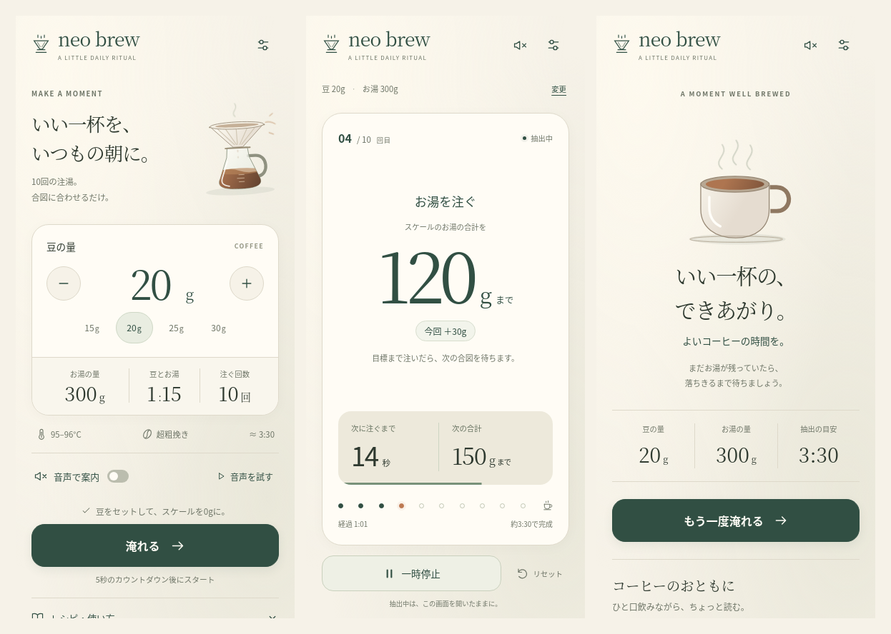

# A little ritual, a lovely cup

Neo Brew Timer now opens straight into a warm, focused preparation screen and
guides a complete brew around the number on the coffee scale. The recipe is
unchanged; its presentation, preparation, completion and audio activation have
been rebuilt.

These are actual Chromium screenshots of the implemented app, not design
mockups. Voice is muted for the repeatable screenshot inspection; the product
defaults to voice and vibration. Articles use the genuine empty state rather
than invented news. Japanese glyphs use the installed Noto CJK fonts; a device's
available serif font determines the final letterforms.

## What the original product taught me

I ran the existing app and used its introduction, dose selection, startup,
bloom, subsequent pours, pause and completion at phone size. I inspected its
recipe calculations, timing, settings, voice files and offline update behavior.
The original typecheck and 85 tests passed before rebuilding.

The useful foundation was precise: ten pours at a 1:15 ratio; a 30-second bloom,
then a pour every 15 seconds through 2:30; cumulative water targets; a 3:30
estimated finish; remembered dose; and Japanese/English voices that count down
five seconds before the action. The essential interaction is a glance between
phone and scale with a kettle already in hand.

The previous presentation separated the current target, countdown and next
target into successive blocks. Its timeline represented elapsed time, while
music playback, public debug controls and a mandatory introductory visit added
choices outside that immediate task.

[Original brewing screen](screenshots/before-brew.png)

## What changed

- A new paper, porcelain, forest, sage and clay visual system, with serif weight
  figures, tabular numbers, generous space and restrained shadows. Code-generated
  SVG illustrations show a dripper/server before brewing and a steaming cup
  afterward. Motion is subtle and respects reduced motion.
- Preparation offers direct dose entry, one-gram adjustments and four useful
  presets. Total water, ratio, pour count, temperature, grind and duration are
  readable before starting. The zero-scale reminder sits beside the start
  action. Voice can be switched and actually previewed here.
- Brewing has a stationary cumulative target, an explicit amount to add, and
  plain instructions for what to do once the target is reached. Time until the
  next action and its water target share one panel. Ten markers show pour
  position. Mute is reachable directly from the header.
- Startup, ready, pause, resume, reset and leaving have distinct feedback. A
  canceled startup returns to the first water target instead of an idle
  countdown. Changing language keeps the current session running.
- Completion includes a gently steaming cup, a small bean/water/time receipt,
  another-brew action and coffee reading. Reading also remains available from
  preparation, and is requested only when opened there.
- Audio is activated from a user gesture and shares reusable local elements.
  Operation tokens protect real cues from a late silent warm-up. StrictMode
  effect replay no longer cancels the initial cue. Pause, reset, cancel, mute
  and leaving stop playback. Preview uses a separate element.

The recipe-independent monotonic timer, recipe calculations, wake-lock
controller and their useful tests remain because they serve the experience.
The obsolete presentation and music architecture have been removed. No new
runtime dependency was added.

## Deliberate removals

- Mandatory onboarding and its persistent “intro seen” state. Recipe learning is
  available on demand, and the introduction URL still works.
- Background playlists, floating music players and weekday/music debug options.
- The public fast-forward/debug controls. Internal acceleration is still
  available in memory for development, never as a remembered brewing preference.
- Rotating advertisements in the reading area. Equipment links remain inside
  the optional guide with their affiliate disclosure.
- The old stock photograph, Lottie pour asset, stacked timer cards and
  time-proportional timeline components, including tests specific to those
  removed implementations.

## The UX decisions

The scale target is the visual anchor. It is cumulative, never animated, and
never confused with the extra amount to pour. A 21g dose finishes at exactly
315g; rounded increments alternate where necessary. The scale is zeroed once,
before starting.

The next action is a promise: its time and target are together, and the panel
warms to clay for the final five seconds. Current action, current weight, next
time and next weight remain in fixed positions. The last pour retains its full
target and immediately says to let it drain; completion is explicitly an
estimate, since the app cannot observe the brewer or water level.

Essential brewing controls fit at 320×568. Short phones omit decorative setup
content; landscape places current and next guidance side by side. Larger text
can flow rather than being clipped. Controls have 44px targets, dialogs contain
focus and restore it, and segmented settings support arrow keys. State and
water-target changes are announced politely; countdown ticks are not.

Settings are saved as they change. Storage failures cannot stop a brew. Updates
are offered from preparation and never force a reload during brewing. The app
and all twelve voice files are cached for offline use after an online visit.

## Inspection and corrections

I repeatedly rendered the implementation and inspected the screenshots. The
corrections included global layout specificity that added unwanted scrolling,
small-phone spacing that pushed the start button below the fold, compact
landscape layouts, the misleading final-pour “next” wording, and Japanese
completion copy wrapping into a dangling final character. Audio inspection
also led to fixes for warm-up races and StrictMode startup cleanup.

Final checks:

- `npm run typecheck`: passed.
- `npm run test`: 14 files, 74 tests passed, including recipe boundaries,
  wake-lock races, storage failure and asynchronous audio activation.
- `npm run build`: passed; PWA precaches 22 entries including all 12 voice WAVs.
- `npm run test:e2e`: all three complete user journeys passed: dose and language
  continuity to completion; pause/reset/leave; startup cancel/retry and
  small-phone fit. Final validation repeats each journey three times. Tests wait
  for visible startup before advancing virtual time, avoiding a navigation race.
- `npm run inspect:mobile`: 63 rendered views across Japanese/English at
  390×844, 320×568 and 844×390, plus reduced motion at 430×932. Every view is
  checked for horizontal overflow; active brewing also checks that no scrolling
  is needed. No browser page errors were recorded.
- Real WAV playback was checked separately in Chromium: preview, first cue,
  subsequent cue and mute. These were actual audio elements, not test doubles.
- A production service worker was installed, its voice cache checked, the
  browser put offline, and a complete brew run after reloading without page
  errors.

[Small phone](screenshots/small-phone.png) ·
[Landscape](screenshots/landscape.png) ·
[Geometry report](screenshots/inspection-report.json)

## What I would improve next

Use the product beside a real kettle on iOS Safari and Android Chrome to check
audibility, vibration, wake lock, browser interruptions and background/resume
behavior. The automated checks do not substitute for those physical conditions.
Then evaluate spoken water amounts, using properly prepared offline voice
assets, so each cue can name the next cumulative target. Keep that optional and
as concise as the current countdowns.
